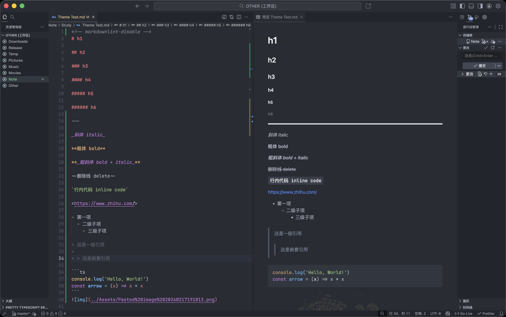
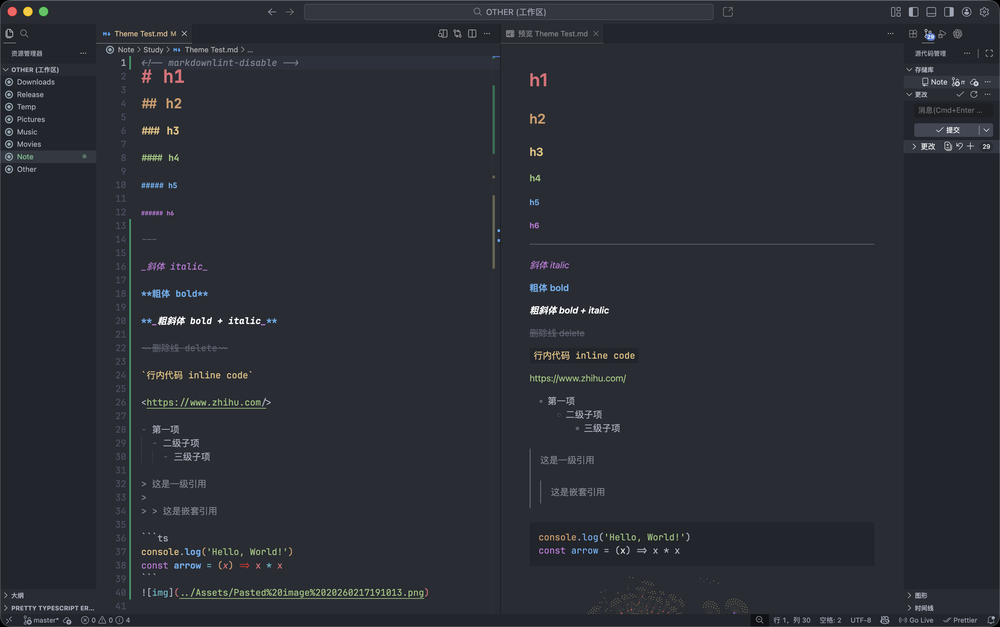

# One Dark Pro enhance

## Enhance the visual display of `markdown` and webview

- init:


- enhance:


## Remove the italitic on JSX attribute

## setting.json

Change the display Boolean values in `setting.json`

```json
"editor.tokenColorCustomizations": {
  "[One Dark Pro]": {
    "textMateRules": [
      {
        "settings": {
          "foreground": "#00ff00",
        },
        "scope": "constant.language.boolean.true",
      },
      {
        "settings": {
          "foreground": "#ff0000",
        },
        "scope": "constant.language.boolean.false",
      },
    ],
  },
},
